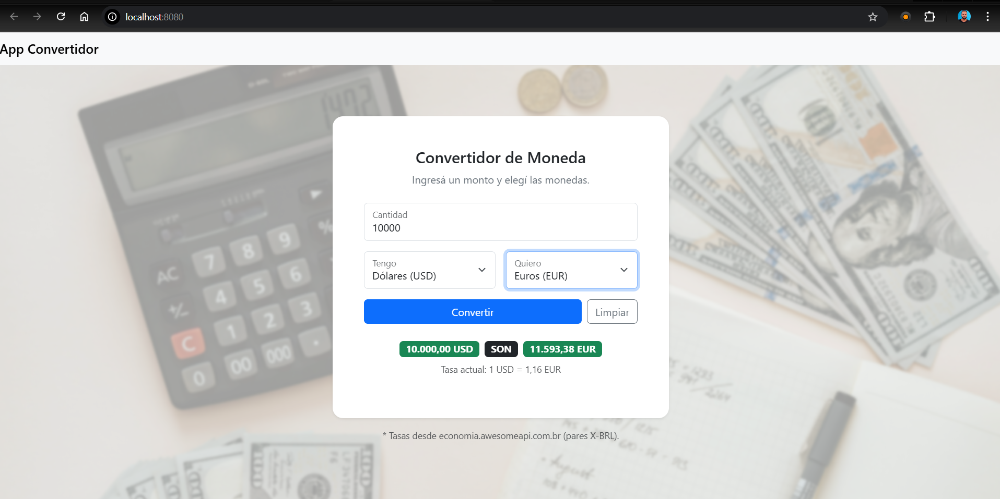

# 💱 Convertidor de Monedas (Vue.js)

Proyecto desarrollado como parte de la materia **Programación Web**, utilizando **Vue.js 3**, **Bootstrap 5** y la **API pública AwesomeAPI** para la obtención de tasas de cambio en tiempo real.

---

## 🧩 Funcionalidades Principales

- Conversión dinámica entre **Dólares (USD)**, **Euros (EUR)** y **Reales (BRL)**.
- Actualización automática de tasas en tiempo real.
- Interfaz moderna y responsive con Bootstrap 5.
- Spinner de carga mientras se obtiene la tasa.
- Manejo de errores y mensajes informativos.
- Formato numérico adaptado a la región (es-AR).
- Código limpio y estructurado con componentes Vue.

---

## ⚙️ Tecnologías Utilizadas

| Tecnología | Descripción |
|-------------|-------------|
| **Vue.js 3** | Framework progresivo de JavaScript |
| **Bootstrap 5** | Framework CSS para diseño responsive |
| **Axios** | Cliente HTTP para llamadas a la API |
| **AwesomeAPI** | API gratuita utilizada para obtener tasas de cambio |

---

## 🧠 Estructura del Proyecto

convertidor/
│
├── src/
│ ├── assets/ # Imágenes y recursos
│ ├── components/
│ │ ├── AppNavbar.vue # Barra de navegación superior
│ │ └── AppConvertidor.vue# Componente principal del conversor
│ ├── App.vue # Componente raíz
│ └── main.js # Punto de entrada de Vue
│
├── public/
│ └── index.html
│
├── package.json
├── .env.local # Configuración opcional de API
└── README.md

---

## 🔗 API Utilizada

**Fuente:** [economia.awesomeapi.com.br](https://economia.awesomeapi.com.br/)

Ejemplo de endpoint:
https://economia.awesomeapi.com.br/last/USD-BRL,EUR-BRL

yaml
Copiar código

Devuelve un JSON con las tasas de cambio actuales, que luego el sistema utiliza para calcular la equivalencia entre monedas por tasa cruzada.

---

## 🧭 Ejemplo de Uso

1. Ingresá una cantidad (por ejemplo, `100`).
2. Seleccioná la moneda que tenés (por ejemplo, `USD`).
3. Seleccioná la moneda a la que querés convertir (por ejemplo, `EUR`).
4. Presioná **Convertir** → verás el resultado actualizado en tiempo real.

---

## 🧰 **Instalación y Ejecución Local**

```bash
# Instalar dependencias
npm install

# Ejecutar el proyecto en modo desarrollo
npm run serve
Luego abrí http://localhost:8080 en tu navegador.

** 🖼️ Vista del Proyecto **



🧑‍💻 Autor

Ignacio Rodríguez
Instituto Tecnológico de Educación Superior (ITES) – La Pampa
Materia: Programación Web
Profesor: Fabio Gross
Año: 2025

📜 Licencia

**Este proyecto es de uso educativo y puede reutilizarse con fines didácticos citando la fuente.**

Powered by Vue.js & Bootstrap 💚


---
